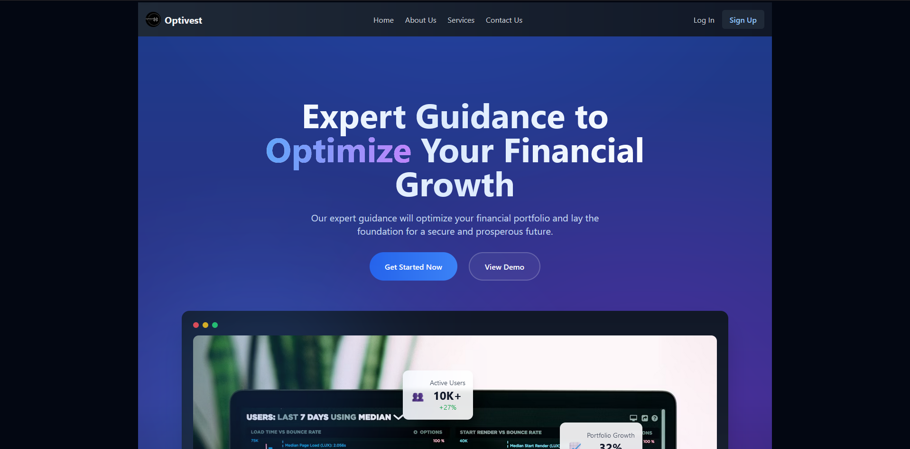

<p align="center">
  <a href="" rel="noopener">
 </a>
</p>

<h3 align="center">optivest-frontend</h3>

<div align="center">

[]()
[](https://github.com/Blue-Davinci/OptiVest-Frontend/issues)
[](https://github.com/Blue-Davinci/OptiVest-Frontend/pulls)
[](/LICENSE)

</div>

---

<p align="center"> Smarter Choices, Brighter Futures, By OptiVest.
    <br> 
</p>



## 📝 Table of Contents

- [About](#about)
- [Getting Started](#getting_started)
- [Deployment](#deployment)
- [Usage](#usage)
- [Built Using](#built_using)
- [TODO](../TODO.md)
- [Contributing](../CONTRIBUTING.md)
- [Authors](#authors)
- [Acknowledgments](#acknowledgement)

## 🧐 About <a name = "about"></a>

The OptiVest Frontend is a comprehensive, user-centered interface for financial management, providing users with real-time insights, recommendations, and portfolio tracking in an intuitive dashboard. Built with SvelteKit and Tailwind CSS, the frontend offers seamless navigation, dynamic data visualizations, and responsive layouts for both desktop and mobile experiences. Core features include budget and expense tracking, goal-setting tools, and sector-diversified investment analysis. 

Through a robust integration with external financial APIs and Golang\Python backend services, the frontend is designed to support efficient and personalized financial decision-making. Its user-friendly approach empowers individuals to monitor and optimize their financial health effectively.

## 🏁 Getting Started <a name = "getting_started"></a>

These instructions will get you a copy of the project up and running on your local machine for development and testing purposes. See [deployment](#deployment) for notes on how to deploy the project on a live system.

### Prerequisites
Prior to running the <b>OptiVest</b> project, you need to make sure that you have the following installed in your system: 
- **Node.js:** This project is built with Svelte, which requires Node.js to run. You can download Node.js from the official website.

- **Visual Studio Code:** This is the recommended code editor for this project. You can download it from the official website.

- **Svelte v5:** This project is built with Svelte. You can install it globally on your system by running npm install -g svelte.

- **Golang and The OptiVest Back-end:** This can be found [here](https://github.com/Blue-Davinci/OptiVest)


```
Give examples
```

### Installing

Start with the gears hot by jumping in your terminal and:

1. **Cloning the Repo:** Clone this repo by doing
```bash
git clone https://github.com/Blue-Davinci/OptiVest-Frontend.git
```

2. **Navigate to the Project Directory:** Done? Easy right? Go ahead and navigate to the directory by doing: 
Say what the step will be

```bash
cd optivest-frontend
```
3. **Install Node.Js:** Haven't installed `node.js`? What are you waiting for, go ahead and download it from their [official website](https://nodejs.org/)

4. **Install Svelte:** Now get your nose deep by downloading svelte like below: 
```bash
npm create svelte@latest 
```

5. **Install the project's dependancies:** Proceed and install the project's dependancies by running:
```bash
npm install
```

6. **Launch the OptiVest Backend:** Start and launch the backend server by following the instructions [here](https://github.com/Blue-Davinci/OptiVest?tab=readme-ov-file#installing)

7. Make sure you have the following 2 files in the root folder i.e `Aggregate-Frontend\` as they hold all the links used to interact with the `API`:
```bash
.env.development
.env.production
```

8. We use `cloudinary`, found [documented here](https://cloudinary.com/documentation/node_image_and_video_upload), for hosting the User avatars. So create a file called `.env` on the root (where the above env.dev... are) and add your key + secret
as Shown below:

```bash
CLOUDINARY_API_KEY=<cloudinary api key xxxxxx>
CLOUDINARY_API_SECRET=<cloudinary api secret yyyyy>
```

- You also need to add an **encryption key and IV** in the above file which will be used in encrypting the user api_keys. You can generate both the **IV** and **Encryption key** via the `generator.js` in `lib\utilities\encryption.js`
- For a **quick generation** you can use the `javascript debugger terminal` by first navigating to the directory:

```bash
cd src/lib/utilities
```

- Then **execute** the file by running:

```bash
node encryption.js
```

- You will find a `.env` file in the same directory. You can open and copy the data to the root `.env`, which should have your `cloudinary secrets`, or change it with the `Admin dashboard` *(in the pipeline)*

8. After a succesful setup+startup of the **OptiVest backend API - above**- proceed and start the development server by running:
```bash
npm run dev
```

<b>The Optivests's Frontend</b> should now be running on your local machine. You can access it by opening your web browser and navigating to `http://localhost:5173` (or the port number displayed in your terminal).

- After signing up and logging in, you should see something like this:


End with an example of getting some data out of the system or using it for a little demo.


## 🎈 Usage <a name="usage"></a>

<b>The basics of the app includes:</b>

1. Homepage: This is the first page for users `http://localhost:5173` and contains the landing page 
You will find:
            - About
            - Contact Us
            - Features
2. User Dashboard: This is the gist of everything and contains all you'll need to administer your finances includeing:
- User management with:
  - Login capability
  - Account recovery
  - Signup & Register
  - Startup Wizard (in progress)
  - User settings and profile changes (in progress)
- User Dashboard with:
  - Personal Finance manager with:
     - Budget Manager
     - Goal Manager
  - Personal Finance Tracker with:
      - Expense Tracker
      - Income Tracker
      - Debt Tracker
  - Group Manager (in progress) with:
      - Create your group
      - Manage your group including setting it as private or public
      - Invite users, if private, and set goals, manage expenses together
  - Investment Portfolio with:
      - In depth analysis of uour potfolio
      - Add stocks, bonds and alternative investmnets
      - Manage these investments via setting indicators and reminders
      - Ask for indepth analysis including risks and different information
      - Portfolio rebalancing
  - Personal Finance Portfolio
      - In depth analysis of your personal finances
      - Ask for in-depth analysis of your portfolio
  - Feeds And Edication
      - A ffeds section that allows you to peruse and gain actionable data & info
       on invetsments you own or follow.
      - Like, un-like, save and share feeds to your friends and family.
      - Gain educational materials from different finance educators.
  - Payment Capability (in progress)
  - Notification manager which include: (in progress)
      - Management of your notifications and remonders
      - Custom pings on different stock changes.

## A note:
- The application uses different API connection strings based on the environment (development or production).
- The settings can be found in the `.env.development` and `.env.production` files. The prod strings involve connections to & from the docker container.

## ⛏️ Built Using <a name = "built_using"></a>

- [Node.js](https://nodejs.org/en/) - Server Environment
- [Tailwind CSS](https://tailwindcss.com/) - CSS Framework
- [Svelte-SuperForms](https://superforms.rocks/) - For form management
- [Layer-Chart](https://www.layerchart.com/) - For customizeable and engaging Charts
- [Svelte](https://svelte.dev/) - Innovative Framework for building user interfaces
- [SvelteKit](https://kit.svelte.dev/) - Framework for building web applications with Svelte
- [Paystack](https://paystack.com/) - Give your customers the gift of modern, frictionless, painless payments. Integrate Paystack once and let your customers pay you however they want.
- [Cloudinary](https://cloudinary.com/) - Cloudinary is a cloud-based service that provides an end-to-end image and video management solution, including uploads, storage, manipulations, optimizations, and delivery.
- [Zod](https://github.com/colinhacks/zod) - TypeScript-first schema validation with static type inference
- [Shad-CN Svelte](https://www.shadcn-svelte.com/) - Beautifully designed components that you can copy and paste into your apps. Accessible. Customizable. Open Source.
- [RoboHash](https://robohash.org/) - Robohash is a easy web service that makes it easy to provide unique, robot/alien/monster/whatever images for any text.
- [Lucid-Svelte](https://lucide.dev/) - Beautiful & consistent icons
Simple Open Source icons carefully crafted for designers & developers. Made by the community.
- Other items not mentioned.

## ✍️ Authors <a name = "authors"></a>

- [@Blue-Davinci](https://github.com/Blue-Davinci) - Idea & Initial work

See also the list of [contributors](https://github.com/Blue-Davinci/OptiVest-Frontend/contributors) who participated in this project.

## 🎉 Acknowledgements <a name = "acknowledgement"></a>

👥 See also the list of [contributors](https://github.com/Blue-Davinci/OptiVest/contributors) who participated in this project.

🎩✨ Hat tip to:
- [Official Svelte](https://learn.svelte.dev/tutorial/welcome-to-svelte)
- [HuntaByte](https://www.youtube.com/@huntabyte)
- [CiscoHeat](https://github.com/ciscoheat)
- [SeanLynch](https://twitter.com/techniq35)
- Any and all people whose libraries\codes were used.
